# **Agentic Data Pipeline: An Architectural Overview**

<p align="center">
  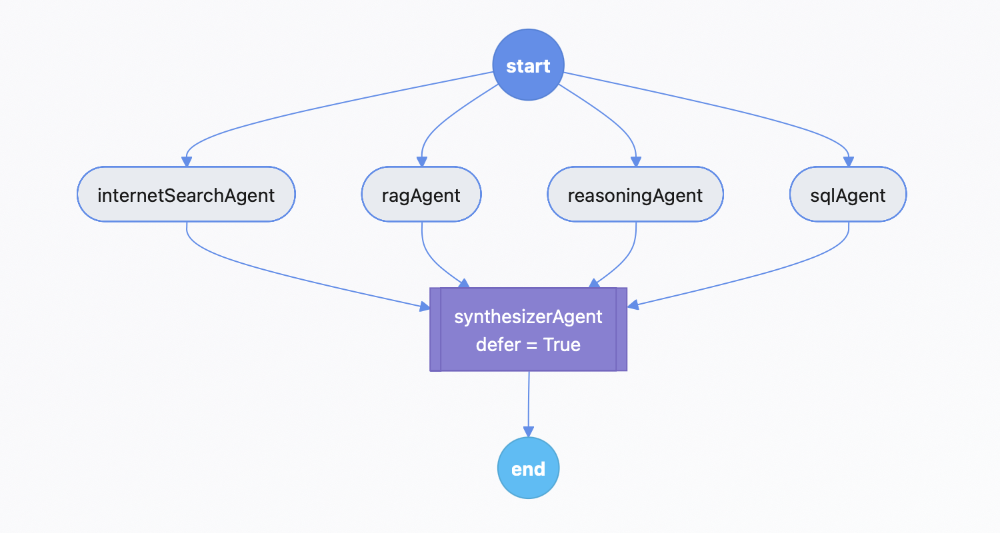
</p>

<p align="center">
    <a href="https://github.com/RauhanAhmed/AgenticDataPipeline">
      
    </a>
    
    
</p>

<p align="center">
    <a href="https://agenticdatapipeline.lovable.app/">
      
    </a>
    <a href="https://rauhan-agenticdatapipeline.hf.space/docs">
      
    </a>
</p>

---

## **Table of Contents**

1. [Introduction & Project Philosophy](#1-introduction--project-philosophy)
2. [Directory Structure](#2-directory-structure)
3. [System Architecture & Data Flow](#3-system-architecture--data-flow)
4. [Agent Details](#4-agent-details)
5. [Technology Stack](#5-technology-stack)
6. [Visual Documentation](#6-visual-documentation)
7. [Local Installation Guide](#7-local-installation-guide)
8. [Roadmap](#8-roadmap)
9. [Author](#9-author)
10. [License](#10-license)

---

## **1. Introduction & Project Philosophy**

Working with data usually means dealing with scattered sources: PDFs, wiki pages, SQL databases, CSVs, and the internet. Answering a real question often means pulling something from each of them, understanding the context, and then combining it all into a clear answer.

The **Agentic Data Pipeline** is built around this idea. Instead of relying on a single “super model,” the system uses **multiple small, focused AI agents**, each good at one thing—document retrieval, SQL queries, web search, or reasoning. Their outputs are combined by a final synthesizer agent that produces a single coherent answer.

The goal is simple:

**Break the problem into specialized steps, run them in parallel, and combine the results intelligently.**

### **1.1. Live Demonstrations**

* **Frontend UI:** [https://agenticdatapipeline.lovable.app](https://agenticdatapipeline.lovable.app)
* **Backend API (Swagger):** [https://rauhan-agenticdatapipeline.hf.space/docs](https://rauhan-agenticdatapipeline.hf.space/docs)

---

## **2. Directory Structure**

Only core project files are included — unnecessary system files (`.DS_Store`, `.venv/`, caches) have been removed.

```
AgenticDataPipeline/
├── LICENSE
├── README.md
├── requirements.txt
├── Dockerfile
├── prompts.yaml
├── config.ini
├── .gitignore
├── .python-version
├── main.py
│
├── demo/
│   ├── demo1.png
│   ├── demo2.png
│   ├── demo3.png
│   ├── demo4.png
│   ├── demo5.png
│   ├── workflowDiagram.png
│   ├── frontend.png
│   ├── fastapiSwaggerUI.png
│   ├── langsmithDashboard.png
│   ├── langsmithTracing.png
│   ├── langgrapphMermaidExport.png
│   ├── postgreSQLAgentData.png
│   └── qdrantVectoDB.png
│
├── internalDocs/
│   ├── ai_job_dataset.csv
│   ├── Algorithm - Wikipedia.pdf
│   ├── Computer science - Wikipedia.pdf
│   ├── Data structure - Wikipedia.pdf
│   ├── Database - Wikipedia.pdf
│   ├── Operating system - Wikipedia.pdf
│   └── Programming language - Wikipedia.pdf
│
├── utils/
│   ├── __init__.py
│   ├── logger.py
│   ├── exceptions.py
│   └── initMethods.py
│
├── api/
│   ├── __init__.py
│   ├── models.py
│   └── services.py
│
├── notebooks/
│   ├── VectorDBPopulator.ipynb
│   ├── SQLPoplulator.ipynb
│   └── IndividualAgents.ipynb
│
└── src/
    ├── __init__.py
    ├── workflows/
    │   ├── __init__.py
    │   └── workflow.py
    └── components/
        ├── __init__.py
        ├── ragAgent.py
        ├── sqlAgent.py
        ├── reasoningAgent.py
        ├── internetSearchAgent.py
        └── synthesizerAgent.py
```

---

## **3. System Architecture & Data Flow**

The system is implemented as a **stateful Directed Acyclic Graph (DAG)** using **LangGraph**, with **FastAPI** as the public-facing interface.

### **3.1. AgentState**

All agents exchange information through a shared state object:

```python
class AgentState(TypedDict):
    query: str
    ragResults: Optional[str]
    sqlResults: Optional[str]
    webResults: Optional[str]
    reasoningResults: Optional[str]
    finalAnswer: Optional[str]
```

### **3.2. End-to-End Flow**

1. The `/answerQuery` API receives a query.
2. A fresh AgentState is created.
3. LangGraph fans out into **four parallel agents**:

   * RAG
   * PostgreSQL
   * Internet Search
   * Reasoning
4. Each agent writes back into the state.
5. LangGraph waits until all four complete.
6. The **Synthesizer Agent** merges all outputs.
7. The final answer is returned.

---

## **4. Agent Details**

### **4.1. RAG Agent (“The Librarian”)**

* **Model:** Llama 3.3 70B
* Works with internal PDFs, wikis, and other documents
* Retrieval:

  * Dense: `BAAI/bge-large-en-v1.5` → Qdrant
  * Sparse: BM25
* Output → `ragResults`

### **4.2. PostgreSQL Agent (“The Data Whiz”)**

* **Model:** zai-glm-4.6
* Natural-language-to-SQL
* Uses SQLAlchemy + LangChain SQL toolkit
* Output → `sqlResults`

### **4.3. Reasoning Agent (“The Thinker”)**

* **Model:** qwen-3-32b
* Uses chain-of-thought reasoning
* Output → `reasoningResults`

### **4.4. Internet Search Agent (“The Web Surfer”)**

* Uses Google Serper API
* Output → `webResults`

### **4.5. Synthesizer Agent (“The Editor-in-Chief”)**

* **Model:** gpt-oss-120b
* Merges everything using:

  1. Internal docs + SQL
  2. Internet Search
  3. Reasoning
* Output → `finalAnswer`

---

## **5. Technology Stack**

| Layer       | Technology       | Reason                          |
| ----------- | ---------------- | ------------------------------- |
| API         | FastAPI, Uvicorn | Fast, async, clean docs         |
| Workflow    | LangGraph        | Parallel stateful orchestration |
| VectorDB    | Qdrant           | Dense + sparse hybrid retrieval |
| DB          | PostgreSQL       | Reliable relational backend     |
| LLM Hosting | Cerebras         | Fast and affordable inference   |
| Containers  | Docker           | Reproducible deployments        |

---

## **6. Visual Documentation**

### **6.1. Sample Outputs**

<p align="center">
  <br>
  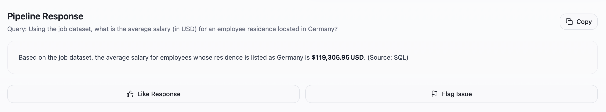<br>
  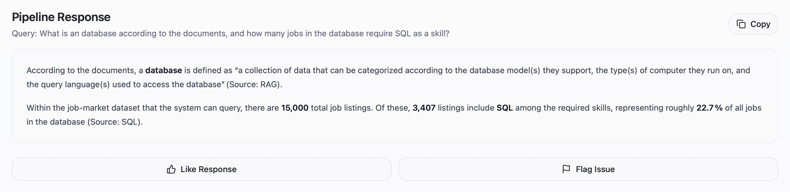<br>
  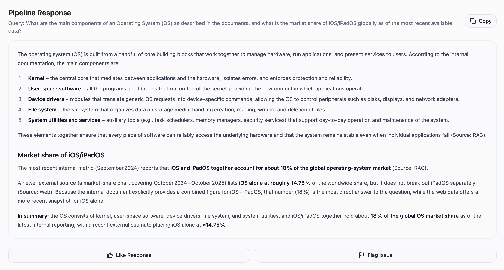<br>
  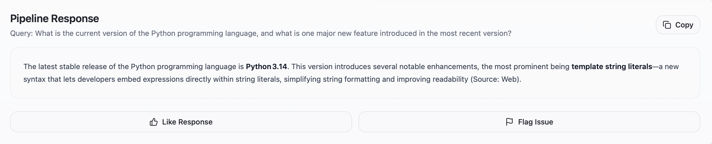
</p>

### **6.2. Frontend & API**

<p align="center">
  <b>Frontend Interface</b><br>
  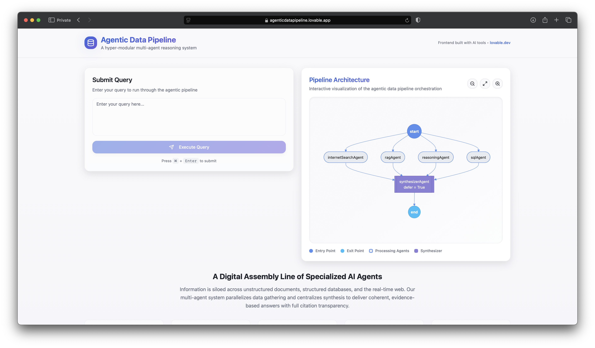
</p>

<p align="center">
  <b>FastAPI Swagger UI</b><br>
  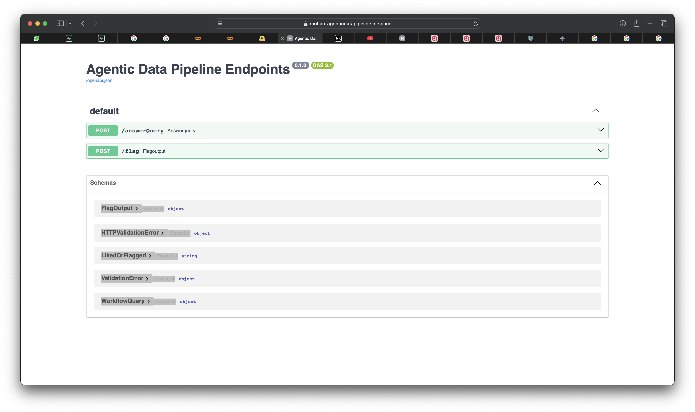
</p>

### **6.3. Workflow & Architecture**

<p align="center">
  <br>
  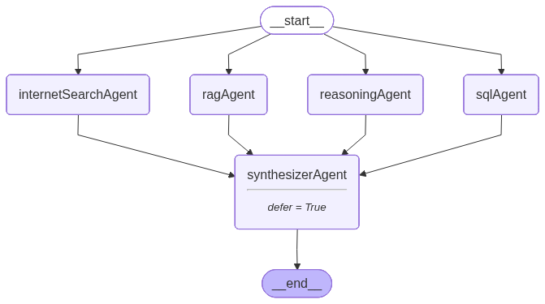
</p>

### **6.4. Storage & Retrieval Layers**

<p align="center">
  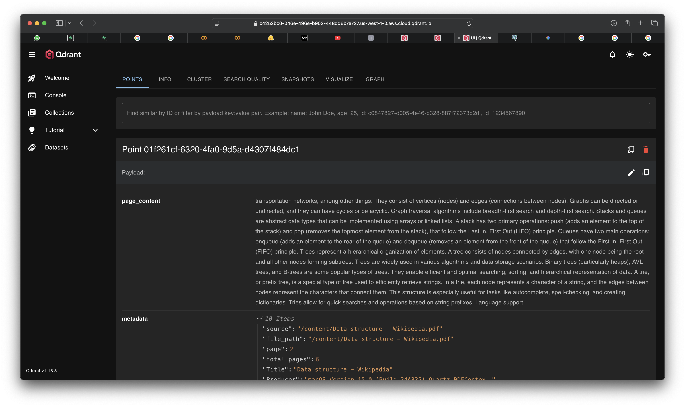
</p>

<p align="center">
  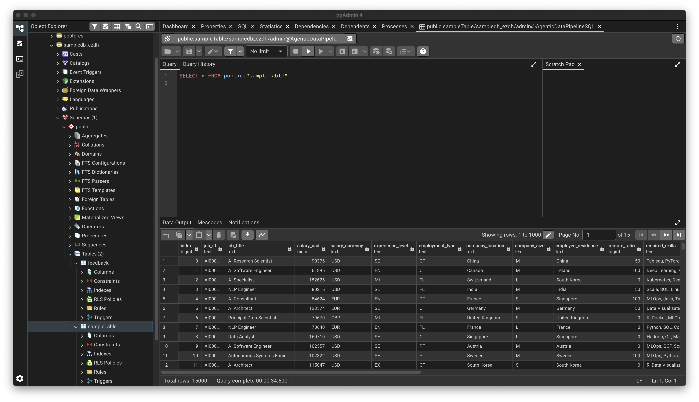
</p>

### **6.5. Monitoring & Tracing**

<p align="center">
  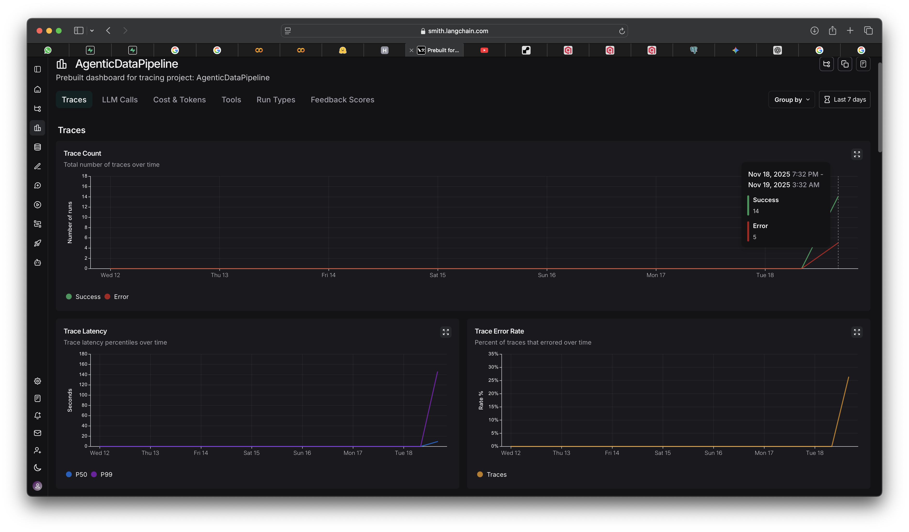<br>
  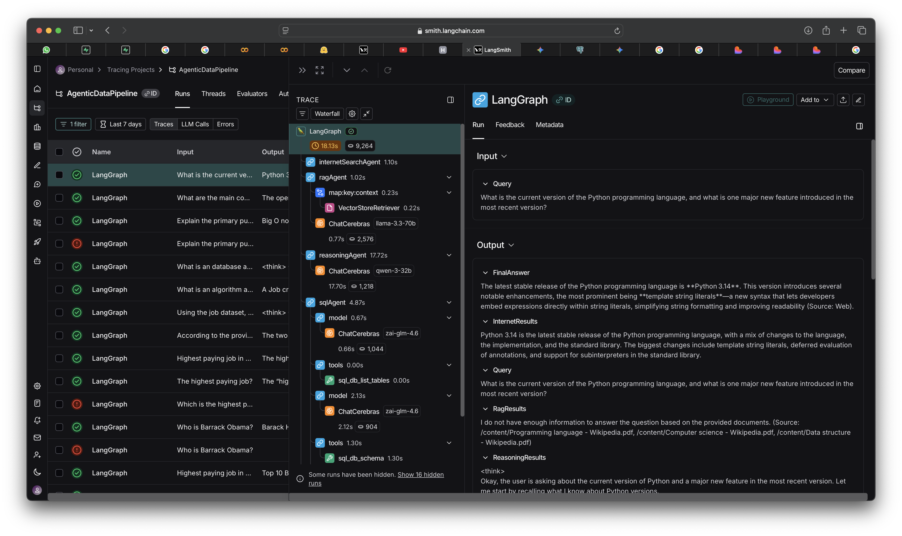
</p>

---

## **7. Local Installation Guide**

### **7.1. Requirements**

* Python 3.12+
* Docker Engine

### **7.2. Installation Steps**

#### **1. Clone the repo**

```bash
git clone https://github.com/RauhanAhmed/AgenticDataPipeline.git
cd AgenticDataPipeline
```

#### **2. Create `.env`**

You’ll need keys for:

* QDRANT_API_KEY
* QDRANT_URL
* POSTGRE_CONNECTION_STRING
* CEREBRAS_API_KEY
* SERPER_API_KEY
* Additional LLM keys as needed

#### **3. Create virtual environment**

```bash
python3 -m venv .venv
source .venv/bin/activate
pip install -r requirements.txt
```

#### **4. Build & run Docker**

```bash
docker build -t agentic-data-pipeline .
docker run -p 7860:7860 -d --env-file .env agentic-data-pipeline
```

### **7.3. Populate Data**

#### **Vector Database (Qdrant)**

```
notebooks/VectorDBPopulator.ipynb
```

#### **PostgreSQL Database**

```
notebooks/SQLPoplulator.ipynb
```

### **7.4. Test the Pipeline**

```bash
curl -X POST http://localhost:7860/answerQuery \
  -H "Content-Type: application/json" \
  -d '{"query": "How many data scientist jobs are available in California?"}'
```

---

## **8. Roadmap**

* [ ] Add Reciprocal Rank Fusion (RRF)
* [ ] Feedback-driven fine-tuning loop
* [ ] New specialized agents (filesystem, JIRA, etc.)
* [ ] Optional Streamlit/Gradio UI

---

## **9. Author**

Built by **Rauhan Ahmed**
Portfolio: [https://rauhanahmed.in](https://rauhanahmed.in)

Contributions welcome — feel free to open an issue or PR.

---

## **10. License**

MIT License. See `LICENSE`.

---